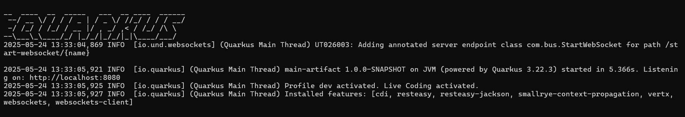

# Bus Scheduler

A Quarkus-based application designed for bus scheduling and management.

## Prerequisites

Before you begin, ensure you have the following installed on your system:

*   **Git:** To clone the repository. ([Download Git](https://git-scm.com/downloads))
*   **Java Development Kit (JDK):** Version 21 or higher (Quarkus typically requires this). ([OpenJDK Downloads](https://jdk.java.net/))
*   **Apache Maven:** Version 3.8.x or higher. ([Download Maven](https://maven.apache.org/download.cgi))

## Getting Started

Follow these steps to clone the repository and run the application locally.

### 1. Clone the Repository

Open your terminal or command prompt and run the following command to clone the project to your local machine:

```bash
git clone https://github.com/Ayush04H/bus_scheduler.git
```
### 2. Navigate to the Project Directory

Change your current directory to the newly cloned project folder:

```
cd bus_scheduler
```

### 3. Run the Application (Development Mode)

Inside the bus_scheduler directory, run the following Maven command to start the Quarkus application in development mode:

```
mvn quarkus:dev
```

What this command does:
* It compiles your Java code.
* It starts the Quarkus application.
* It enables "live reload," meaning that when you make changes to your code (Java files, resource files, etc.), Quarkus will automatically recompile and restart the application, allowing you to see your changes quickly without a manual restart.


### 4. Access the Application
Once the application has started successfully, you should see output in your terminal similar to:



* You can now access the application by opening your web browser [Google Chrome Prefered] and navigating to:
http://localhost:8080
* If your application has REST endpoints, you can usually find a list of them or interact with them via a path like http://localhost:8080/q/dev/ (Quarkus Dev UI) 
* if quarkus-resteasy-reactive-qute or similar is included, or directly via their defined paths (e.g., http://localhost:8080/api/data/allstops).


[Watch How to run in CMD (Powershell or Terminal)](https://drive.google.com/file/d/1E9F8GURC36dKOWdVfxCpuE0afCOFaaHA/view?usp=drive_link)

### Watch the Command Runner Demo

[](https://drive.google.com/file/d/1E9F8GURC36dKOWdVfxCpuE0afCOFaaHA/view?usp=drive_link)

*(Click the image above to watch the video on GitHub)*

### 5. Stopping the Application
To stop the development server, go back to your terminal window where mvn quarkus:dev is running and press Ctrl+C.


## Demo Video Of Application

[](https://drive.google.com/file/d/1p4hl_Dgu3sjkWuPrNExtyAKCGRtYjpZi/view?usp=sharing)


